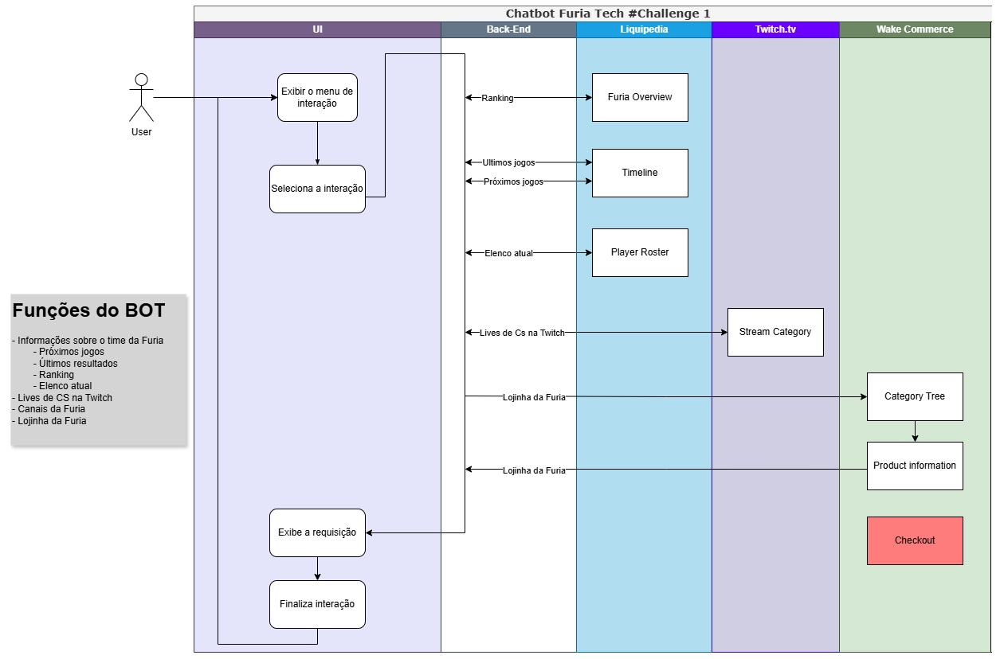

# FURIA Fan Bot

Bot do Telegram para fãs da FURIA Esports acompanharem o time de CS2, lives, canais oficiais e produtos da lojinha.

## ✨ Funcionalidades

- **Menu principal interativo** com navegação por botões
- **Informações sobre o time da FURIA**
  - Próximos jogos (mock)
  - Últimos resultados (mock)
  - Ranking (mock)
  - Elenco atual (mock)
- **Lives de CS na Twitch** (mock)
- **Canais oficiais da FURIA** (mock)
- **Lojinha da FURIA** (mock)
- Navegação fluida entre menus e submenus
- Código pronto para integração com APIs reais

## 📸 Diagrama de arquitetura do BOT



## 🚀 Como rodar o projeto

### 1. Clone o repositório

```bash
git clone https://github.com/arigideon/fan-chat.git
cd fan-chat
```

### 2. Crie e ative um ambiente virtual (opcional, mas recomendado)

```bash
python -m venv .venv
# Windows
.venv\Scripts\activate
# Linux/Mac
source .venv/bin/activate
```

### 3. Instale as dependências

```bash
pip install -r requirements.txt
```

### 4. Configure as variáveis de ambiente

Crie um arquivo `.env` na raiz do projeto com o seguinte conteúdo:

TELEGRAM_TOKEN=seu_token_do_bot_aqui


> **Dica:** Nunca compartilhe seu token do bot publicamente!

### 5. Execute o bot

```bash
python main.py
```

O bot estará rodando e pronto para receber comandos no Telegram.


---

```markdown
## 🧭 Como usar

1. Inicie uma conversa com o bot no Telegram (adicione pelo username configurado no BotFather).
2. Use o comando `/start` para abrir o menu principal.
3. Navegue pelas opções usando os botões interativos.
4. Use os botões de voltar para retornar ao menu anterior.

## 🗂️ Estrutura do Projeto

furia-fan-bot/
├── main.py
├── requirements.txt
├── .env
├── .gitignore
└── README.md

## 📚 Próximos passos e sugestões de evolução

- Integrar com APIs reais (HLTV, Twitch, etc)
- Implementar o checkout simplificado dentro do chat
- Implementar testes automatizados
- Adicionar suporte a múltiplos idiomas